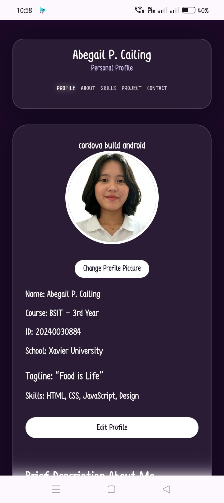
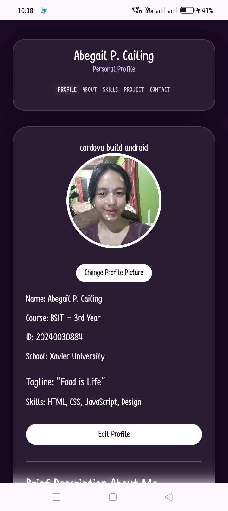
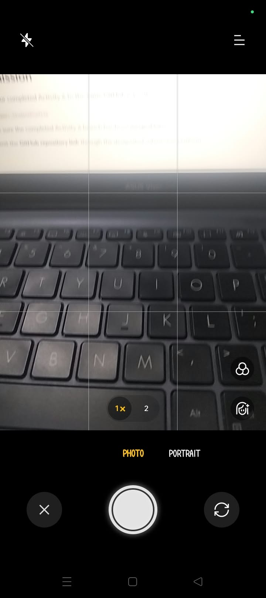
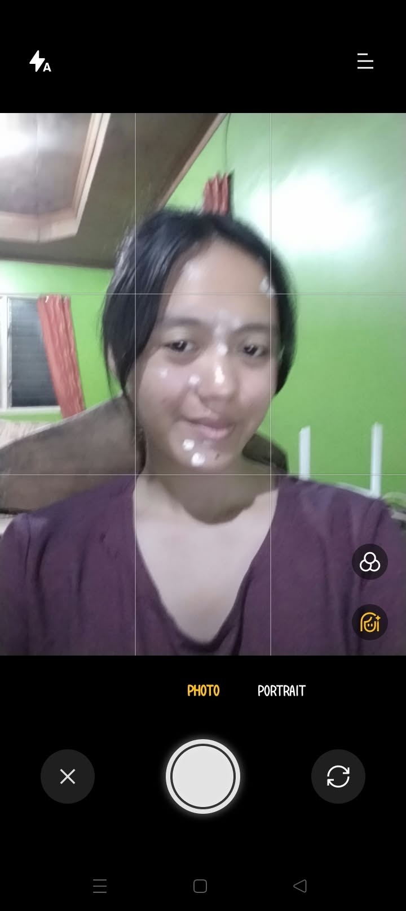
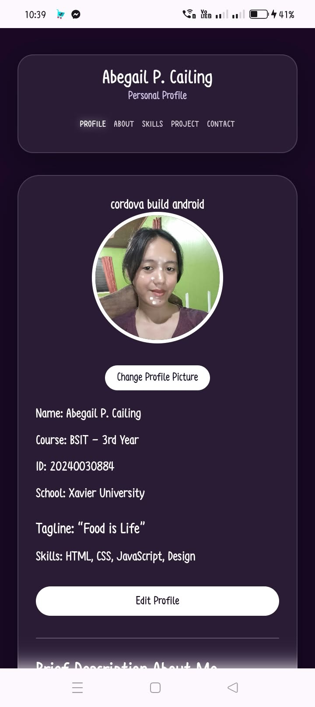

# Activity 6 - Profile Picture Camera Integration

# Project Description
- The Student Profile application is a hybrid mobile app built with HTML, CSS, JavaScript, and Apache Cordova. It allows students to view and edit their profile, including personal information, skills, and projects. It also uses local storage to save profile changes and supports taking a profile picture using the device camera.

# Application Pages
- Profile: Shows the student's basic information, bio, profile picture, and options to edit the profile.
- About: Contains the student's background, values, and academic journey.
- Skills: Displays the student's technical and creative skills.
- Projects: Shows the student's academic and personal projects.
- Contact: Provides the student's contact information and communication channels.

# Profile Editing
- The Edit Profile feature allows users to update their profile through a modal form. Required fields such as Name, Course, Year Level, and Bio are checked before saving. The updated information is stored in localStorage and automatically loaded when the app is opened again.

# Camera Integration
- The app uses the Cordova Camera Plugin to let users take a photo using the device camera. When the user taps Change Profile Picture, the camera opens and captures the image. The photo is then displayed as the profile picture and saved in localStorage so it stays after reopening the app.

# Device Feature Integration
- Apache Cordova allows the app to access mobile device features through plugins. In this project, the Camera Plugin connects the web-based app to the device camera, allowing users to take and use photos directly in the application.

# Image Handling
- The app converts the captured photo into a Base64 image and displays it as the user's profile picture. The image is also saved in localStorage along with the profile information. When the app is reopened, the saved picture is loaded automatically instead of using the default profile image.

## Error Handling
- The app handles camera errors and permission issues by showing a simple alert to the user. If the user cancels taking a photo, the current profile picture stays unchanged. Unexpected camera errors are also logged for easier debugging.

## Responsive Design
- The app uses responsive CSS to adjust its layout for different screen sizes. On desktop and tablet, the content is organized in centered cards, while on mobile, the layout stacks for easier viewing and navigation. Buttons, images, and forms are also adjusted to be more touch-friendly.

## How to Run
- To run the app, install Node.js, Cordova CLI, Android SDK, and JDK. Navigate to the project folder, add the Android platform and Camera Plugin, then prepare and build the project. The generated APK can be installed on a physical Android device, or the app can be launched directly using cordova run android.

# Application Screenshots
## Profile Picture

## Change Profile Picture

## Camera

## Captured Image

## Updated Profile Picture
