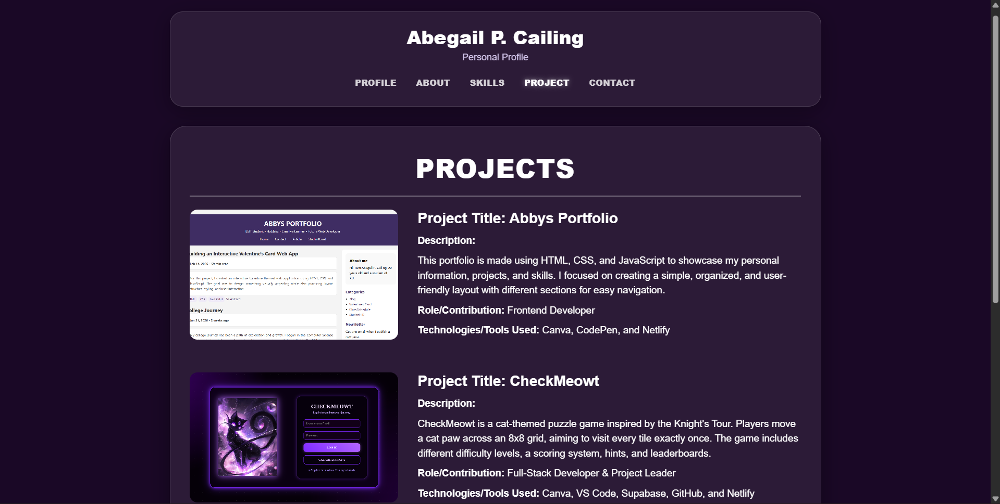
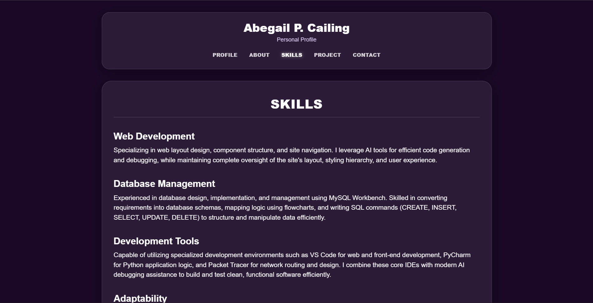
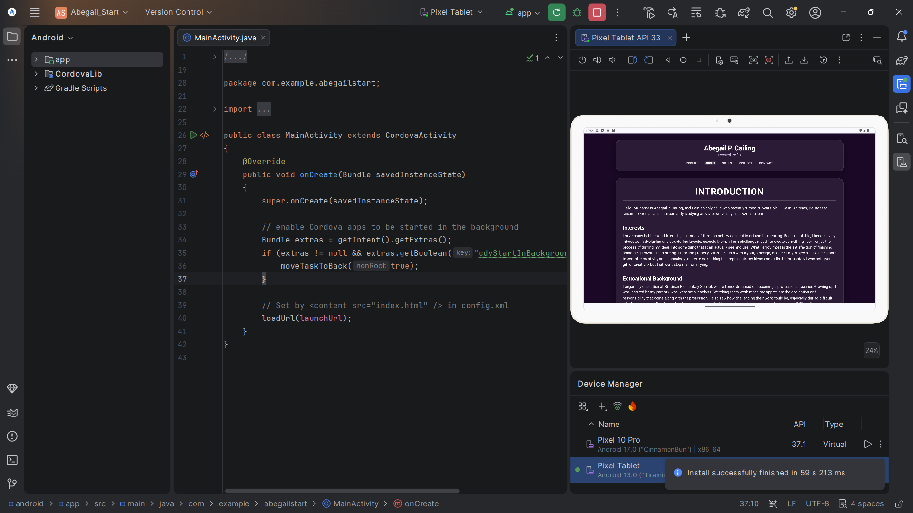
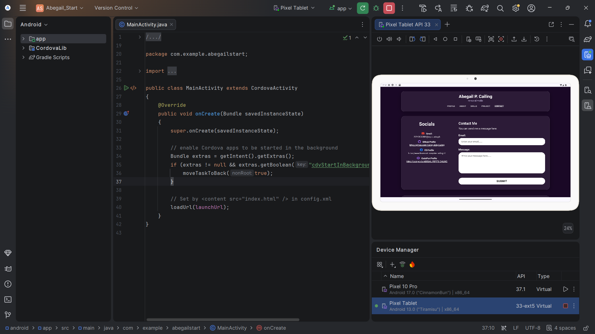

# Activity 4 - Multi-Page Student Profile

# Project Description
- The Multi-Page Student Profile is a cross-platform application built using Apache Cordova, HTML and CSS. It serves as an interactive digital portfolio displaying student information, background details, technical skills, past projects, and contact channels in a structured and user-friendly interface.

# Application Pages
* **Profile (Homepage / index.html):** The main landing page that introduces the student with a brief overview, profile card, and quick links to navigate to other sections but can also utilize the links in the navigation part to access the other pages.
* **About (about.html):** Provides detailed background information about the student, including academic track, interests, and personal bio.
* **Skills (skills.html):** Showcases technical competencies, programming languages, software tools, and design capabilities.
* **Projects (project.html):** Highlights past projects with the project title, its brief descriptions, role/contribution and the technologies/tools used on those projects.
* **Contact (contact.html):** Contains contact information (email, social links, forms) to allow visitors to send a message.

# Navigation 
- Navigation throughout the application is implemented using traditional HTML hyper-links (`` tags) organized within structured navigation menus and quick-link lists across every page. This allows smooth transitions between index.html(home/profile), `about.html`, `skills.html`, `project.html`, and `contact.html` without requiring single-page application.

# Responsive Design
- The application utilizes responsive CSS techniques (including Flexbox, Grid, and Media Queries) to ensure content resizes, shrinks, and stacks cleanly across different devices:
* **Desktop:** Displays wide multi-column layouts where elements like project images and descriptions sit side-by-side.
* **Tablet:** Content automatically shrinks and re-aligns to fit medium-sized screens while keeping spacing and typography balanced.
* **Mobile:** Multi-column layouts dynamically collapse into a single-column view. For instance, on the **Projects page**, the layout automatically adjusts on mobile screens so that project descriptions stack directly underneath their corresponding pictures for optimal readability and vertical scrolling.

# UI/UX Principles Applied
* **Consistency:**
  - Maintained a uniform color scheme, typography, navigation bar, spacing, and visual styling across all pages.
  - Designed matching visual layouts for related sections: the Intro, About, and Skills pages follow the same structured card layout, while the Profile and Contact pages share a complementary layout design.

* **Visual Hierarchy:**
  - Primary information is kept distinct from supporting details using clear typography scaling.
  - Main titles feature the largest font size, followed by subtitles, with body content styled in smaller, readable text.

* **Usability:**
  - Users always know where they are because the active navigation link uses a brighter, whiter color contrast than the rest of the navigation menu.
  - Page content is immediately recognizable, and next navigation steps are always visible.

* **Readability:**
  - Typography dynamically scales and adapts across different device screens (desktop, tablet, mobile) to ensure comfortable reading without manual zooming.

# How to Run
 1. Node.js to install on the system.
 2. Apache Cordova CLI to install globally (`npm install -g cordova`).
 3. Android Studio & ndroid SDK configured, for running on an emulator or real device.

## To run it again/update the HTML and CSS
1. Open the terminal or Git Bash, then navigate to the project root folder like (`cd path/to/Abegail_Start`).
2. Run `cordova prepare android` to sync all updated HTML and CSS files from `www` directory to the Android platform files.
3. Launch Android Studio and open the `platforms/android` directory located inside the project folder.
4. Locate `MainActivity.java` in the left project pane by navigating through `app` > `java` > `com.example.abegailstart` > `MainActivity.java`.
5. Open the Device Manager from the top toolbar, select a virtual device (e.g., i pick Pixel 10 Pro...),then wait for the emulator to fully boot up.
6. Click on the `MainActivity.java` tab and press the green **Run (Play)** button located in the top bar to build and launch the application on the running device.

# Application Screenshots
## Device: Phone
_Phone.png)

## Device: Laptop/Desktop/Chrome

## Device: Tablet

