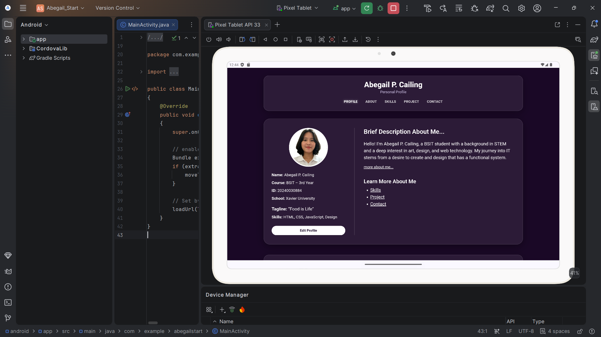
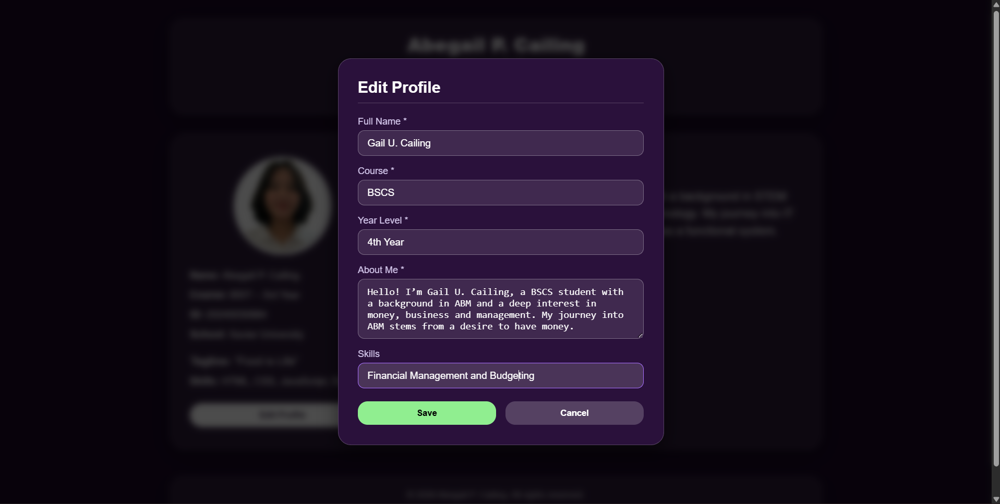
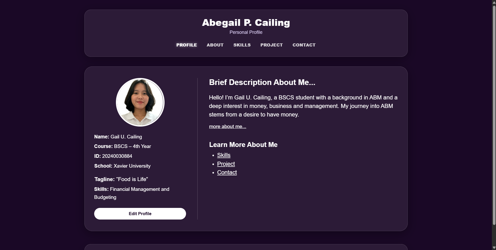
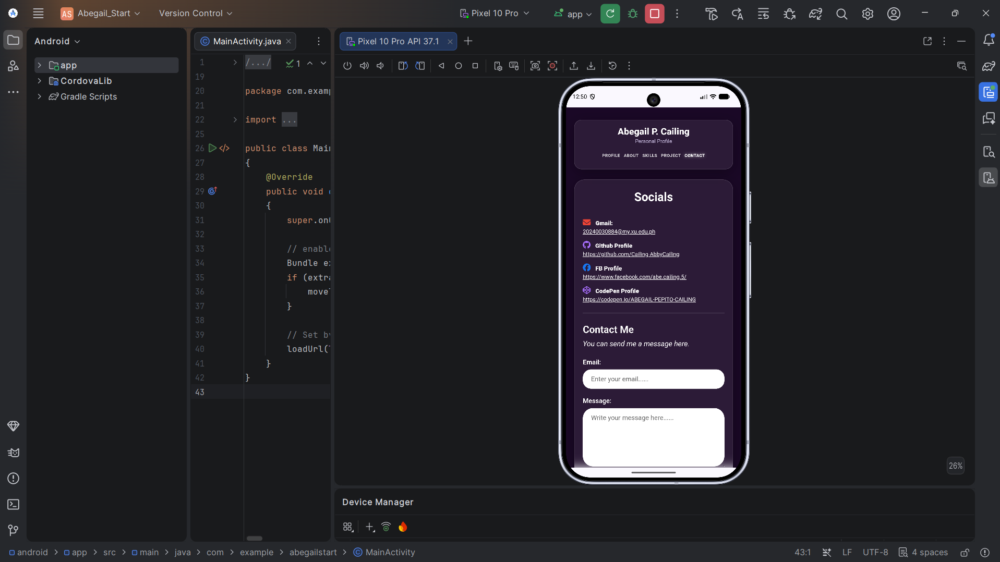

# Activity 5 - Student Profile Editing & Local Data Storage

# Project Description
- The Multi-Page Student Profile is a cross-platform application built using Apache Cordova, HTML and CSS. It serves as an interactive digital portfolio displaying student information, background details, technical skills, past projects, and contact channels in a structured and user-friendly interface. Including profile editing and local data storage features, allowing users to update selected profile information and keep their changes saved even after refreshing or reopening the application.

# Application Pages
* **Profile (Homepage / index.html):** The main landing page that introduces the student with a brief overview, profile card, and quick links to navigate to other sections but can also utilize the links in the navigation part to access the other pages.
* **About (about.html):** Provides detailed background information about the student, including academic track, interests, and personal bio.
* **Skills (skills.html):** Showcases technical competencies, programming languages, software tools, and design capabilities.
* **Projects (project.html):** Highlights past projects with the project title, its brief descriptions, role/contribution and the technologies/tools used on those projects.
* **Contact (contact.html):** Contains contact information (email, social links, forms) to allow visitors to send a message.

# Profile Editing
 - The Edit Profile feature that can be seen in the homepage allows users to update their profile information without reloading the page. When the Edit Profile button is clicked, a pop-up form appears and automatically shows the user's current profile information. Users then can edit their details using the form. When Save Profile is clicked, the system checks if the required fields are filled in. The updated information is then saved in localStorage and displayed on the profile page.
 - Modifying the full name, course, year level, about me description/bio, and the summary skills put in the home page/profile page.

# JavaScript Functionality
 - Form handling: "editForm.addEventListener('submit', saveProfile)" is used form handling, to handle form submissions and prevents the page from refreshing the default page using "event.preventDefault()".
 - Validation: ".trim()" is used to check the validation of the input required to be filled by the user, then it displays an error message and doesn't allow to submit it if any of the fields are empty.
 - Profile Updates: it replaces the content that is in "textContent" with the stored profile with the code "loadProfile()".
 - Save: using this code, it gathers the inputted data into an "updateProfile" object to save in the "localstorage.setItem()" and then it updates the interface after it is submitted.
 - Cancel: it closes the edit popup without saving changes by applying a .hidden CSS class through closeModal().

# Local Data Storage
 - Local Data Storage is like a small storage box inside, making the data saved even if the user refreshes the page or closes the app. In which, "getItem returns null" means it loads the apps data from defaultProfile. Then, "setItem saves { fullName: "Abby", ... }" is then converted into a string inside browser/app storage. After that, when the user refresh or reopens the app or the browser the getItem will then loads the new updated data from the localStorage automatically.

# How to Run
 1. Node.js to install on the system.
 2. Apache Cordova CLI to install globally (`npm install -g cordova`).
 3. Android Studio & ndroid SDK configured, for running on an emulator or real device.

## To run it again/update the HTML and CSS
1. Open the terminal or Git Bash, then navigate to the project root folder like (`cd path/to/Abegail_Start`).
2. Run `cordova prepare android` to sync all updated HTML and CSS files from `www` directory to the Android platform files.
3. Launch Android Studio and open the `platforms/android` directory located inside the project folder.
4. Locate `MainActivity.java` in the left project pane by navigating through `app` > `java` > `com.example.abegailstart` > `MainActivity.java`.
5. Open the Device Manager from the top toolbar, select a virtual device (e.g., i pick Pixel 10 Pro...),then wait for the emulator to fully boot up.
6. Click on the `MainActivity.java` tab and press the green **Run (Play)** button located in the top bar to build and launch the application on the running device.

# Application Screenshots
## Device: Tablet
- Profile Page/Index/Home Page

## Device: Laptop/Desktop/Chrome
- Edit

- Update 

## Device: Phone
- Contact Page

