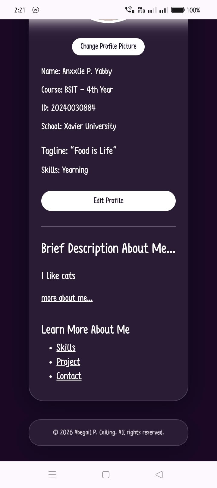
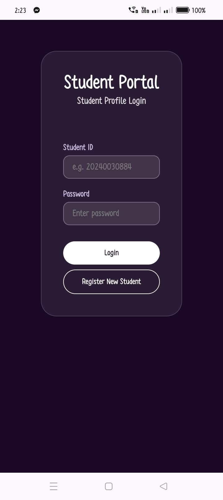
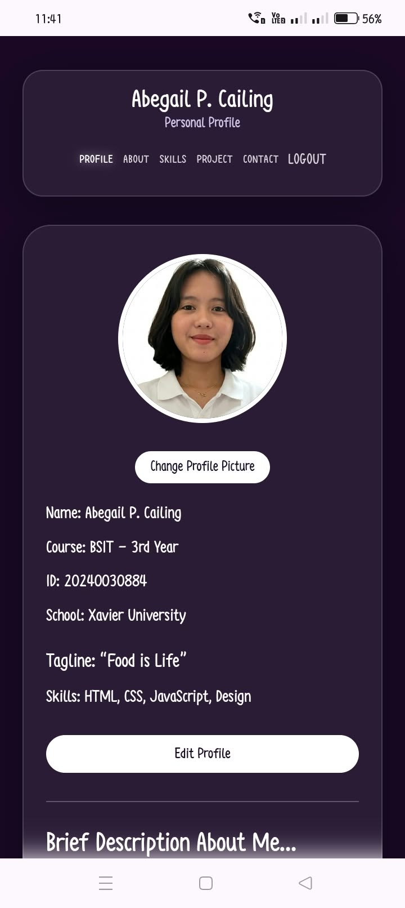
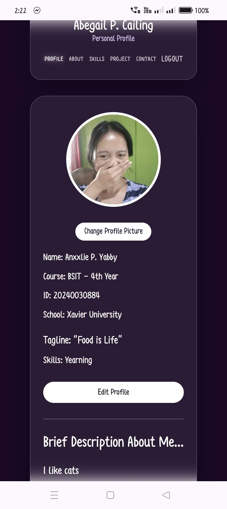
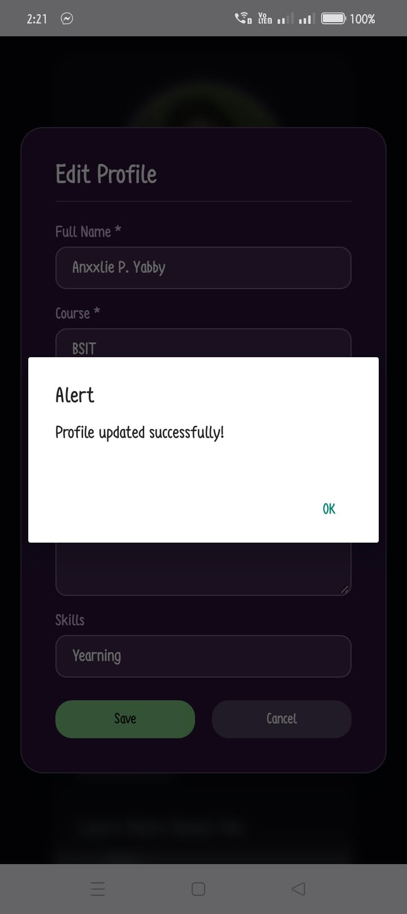
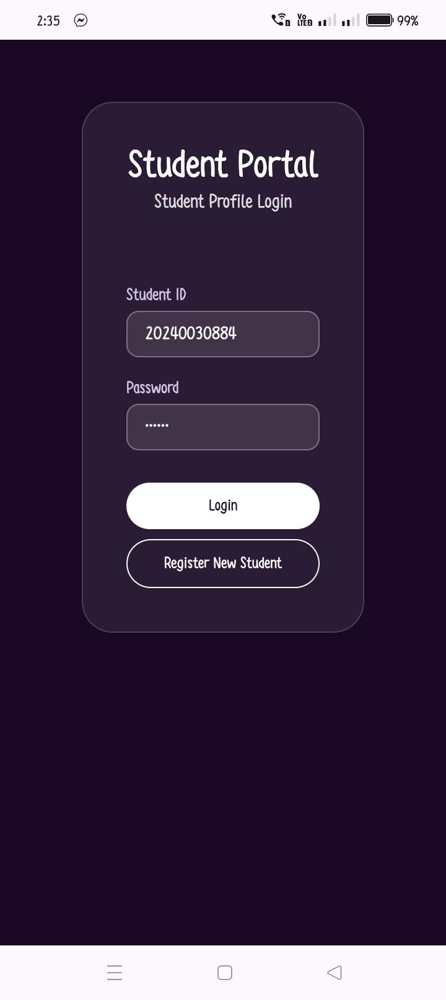
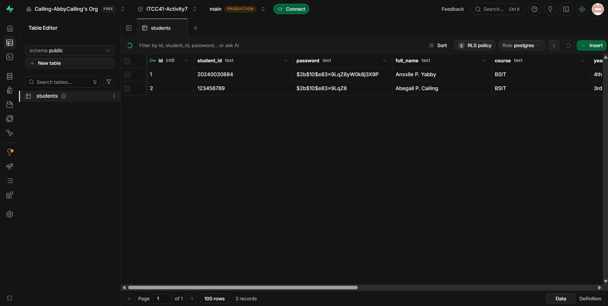

# Activity 7 - Student Login, Authentication & Database

# Project Description
- The Student Profile application is a Cordova-based app that allows students to view and manage their profile information. It originally started as a simple profile website with static information. It was later improved into a database-driven application using Supabase, allowing students to register, log in, view, edit, and delete their profile information. The app also allows users to update their profile picture using the device camera.

# Application Pages
- Profile: Shows the student's basic information, bio, profile picture, and options to edit the profile.
- About: Contains the student's background, values, and academic journey.
- Skills: Displays the student's technical and creative skills.
- Projects: Shows the student's academic and personal projects.
- Contact: Provides the student's contact information and communication channels.
- Login: Allows students to securely log in using their Student ID and password before accessing their profile.

# Authentication
- Users log in using their Student ID and password. The application checks the entered credentials against the student records in Supabase. If the credentials are correct, the student is allowed to access their profile. And if they entered a wrong password, their will be a message "Invalid Student ID or password".

# Student Profile Management
- View Profile — Students can view their personal information after logging in.
- Edit Information — Students can edit their name, course, year level, about me, and skills.
- Save Changes — Updated information is saved to the Supabase database.
- Profile Picture — Students can take a photo using the device camera and save it as their profile picture.
- Log Out — Students can log out, which ends their current session.

# Database Integration
- The application uses **Supabase** as the database. The `students` table stores the following information:
* ID
* Student ID
* Password
* Full Name
* Course
* Year Level
* About Me
* Skills
* Profile Image
* Created and Updated Timestamps

# API/Backend
- The Cordova application uses Supabase as the backend to handle student data and database operations. The application communicates with Supabase to register, log in, retrieve, update, and delete student profile information.
- Basic Architecture: Cordova Application → Supabase Backend → Supabase Database

# CRUD Operation
* **Create** — Registers a new student and creates a profile record in Supabase.
* **Read** — Retrieves and displays the student's profile information from Supabase.
* **Update** — Allows the student to edit and save their profile information.
* **Delete** — Allows the student to delete their account and profile record.

# Camera Integration
- The app uses the Cordova Camera Plugin to let users take a photo using the device camera. When the user taps Change Profile Picture, the camera opens and captures the image. The photo is then displayed as the profile picture and saved in localStorage so it stays after reopening the app.

# Data Persistence
 * Profile information is stored in the Supabase database, so it remains after closing or restarting the application.
 * The logged-in Student ID is stored in localStorage to keep the user session.
 * Logging out removes the saved Student ID from localStorage.
 * When the user logs in again, the app retrieves the profile information from Supabase.

## Responsive Design
- The app uses responsive CSS to adjust its layout for different screen sizes. On desktop and tablet, the content is organized in centered cards, while on mobile, the layout stacks for easier viewing and navigation. Buttons, images, and forms are also adjusted to be more touch-friendly.

## Security
 * Login requires a Student ID and password.
 * Profile data is stored and managed through Supabase.
 * Only logged-in users can access their saved profile using the stored session ID.
 * Supabase is used to handle database access and data management.
 * User profile information is updated through the application and stored in the database.

## How to Run
1. Open the project in **VS Code**.
2. Make sure **Node.js, Cordova, and Android Studio** are installed.
3. Configure the **Supabase database** and update the Supabase URL and API key in `index.js`.
4. Install the project dependencies if needed.
5. Build the Cordova application:
bash 
   cordova build android
6. The APK will be generated in: platforms/android/app/build/outputs/apk/debug/app-debug.apk
7. Transfer the APK to an Android device and install it to run the application.

## Test Accounts
For evaluation and testing purposes, use the following test account credentials to log in:
- **Student ID:** 20240030884
- **Password:** 123456

# Application Screenshots

# Application Screenshots
- Screenshots demonstrating:

## Login Page

## Successful login & Student Profile

## Edit Profile & Profile Picture/Camera

## Updated Profile

## Logout

## Database Related

